# ReVive MYOSA

ReVive: A smart ev safety backup system prototype developed using the MYOSA Mini IOT Kit.

## **Publish Date**

December 2025

 ## **Project Title**

ReVive: Smart EV Safety backup system

## **Excerpt**

ReVive is an intelligent EV safety backup system that predicts crash and slope risks in real time, assists steering and braking decisions, and remains operational through a dedicated LiPo-based backup power system with IoT monitoring.

 ## **Tagline** 
 
Power Reclaimed at Every Stop
When Braking Becomes Backup Power
Turning Motion into Safety and Energy

“Reclaim.Recharge.ReVive”

## Cover Image

## A) ACKNOWLEDGE

 We sincerely thank MYOSA, IEEE Sensors Council, and Pandit Deendayal Energy University (PDEU) for providing the MYOSA Mini IoT Kit and platform to explore real-world sensor-based innovations. We also appreciate the help and support of our faculty mentor Dr. Abhishek Gor and the lab facilities during the development of this prototype.

## B) Overview

The rapid development of electric vehicles has created a new form of risk that all electric vehicles will eventually experience a complete power failure at the worst possible time.
This will put electric vehicle manufacturers in a very precarious position when the very systems we need to keep us safe will also fail at that time.

ReVive is our answer to this problem.

ReVive is a prototype of an Intelligent Electric Vehicle Safety System, which combines regenerative braking, smart power switching, sensor intelligence to predict a potential crash in advance, and to assist in recovering from an emergency situation using Myosa Sensors and ESP32.
ReVive will not only allow us to collect sensor data into fixed numerical values to use that sensor data, but it will also allow us to make a real-time decision based on that sensor data.

### 1. Key Features Summary:

1. **Energy Recovery** — When you brake, it doesn't mean the energy is wasted; the energy created from braking is recovered.
2. **Smart Power Switching** — Automatically switches power sources during failures.
3. **Sensor Intelligence** — Intelligent sensors will notify users of a potential crash before it happens.
4. **Emergency "Revive" Mode** — If the Electric Vehicle loses its primary power, it can still save a person’s life.
5. **Live IoT Dashboard** — Real-time monitoring of the safety systems outside the vehicle via the Internet of Things (IoT).
   
### 2. Quick look at the main features:

- Regenerative Braking Energy Recovery
- Dual Power Architecture (Main Battery and LiPo Backup Battery)
- Automatic Activation of Power Source (via Relay Logic)
- Pre-Crash Prediction using an MPU6050 Sensor
- Slope-Based Risk Determination
- Emergency Revive Mode (includes Buzzer Alerts)
- Safety Logic for Steering Lock and Brakes
- Dashboard providing Live IoT Data utilizing a Personal Computer

## C) Images

## System Demonstration

| View | Image |
|-----|-------|
| Side View | 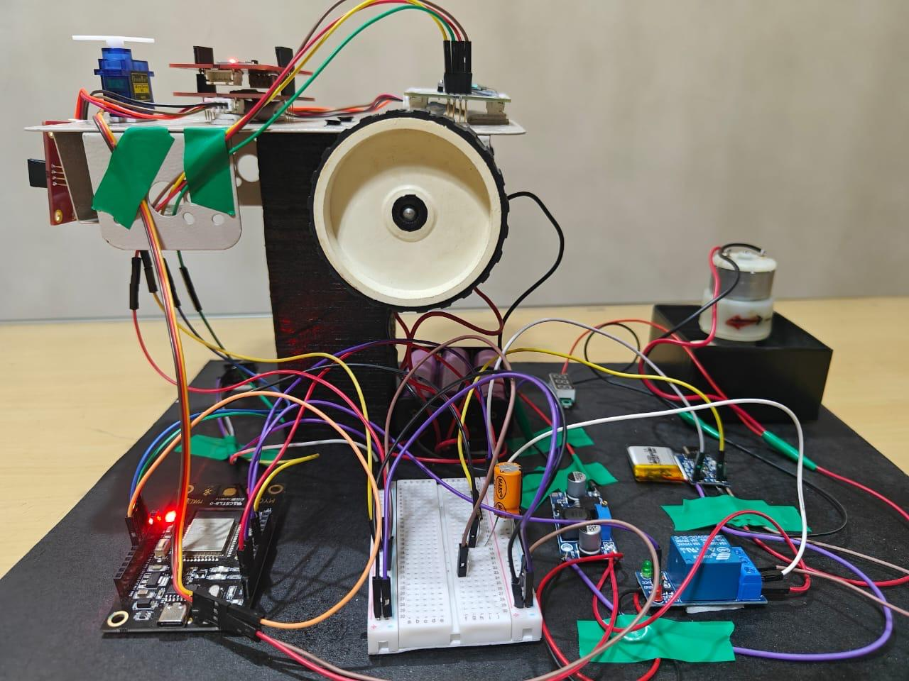 |
| Top View | 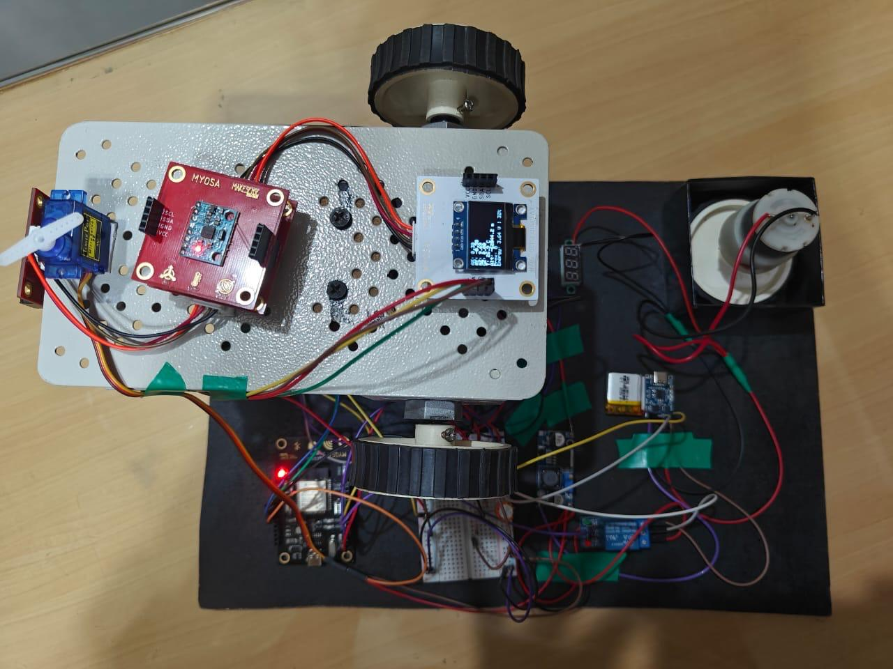 |
| ESP32 Controller | 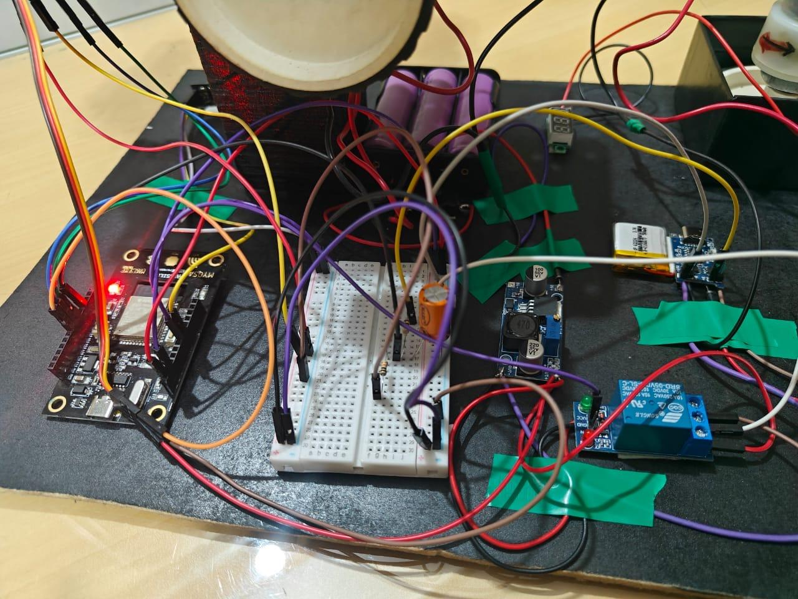 |
| Sensor Readings and Energy level | 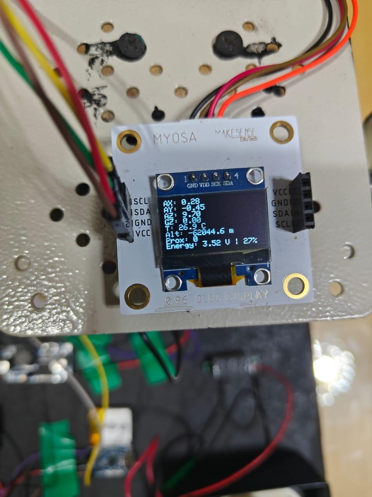 |
| Regenerative Braking |  |
| Slope Detection OLED | 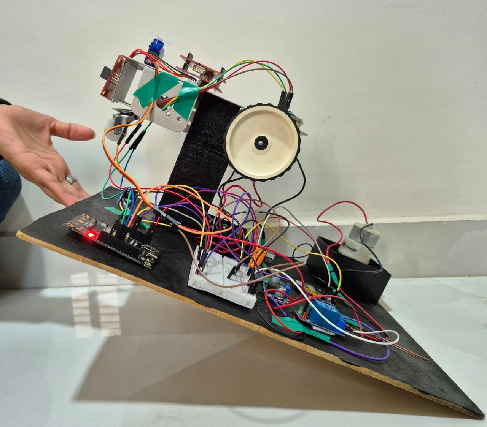 |
| BUZZER based alert system | 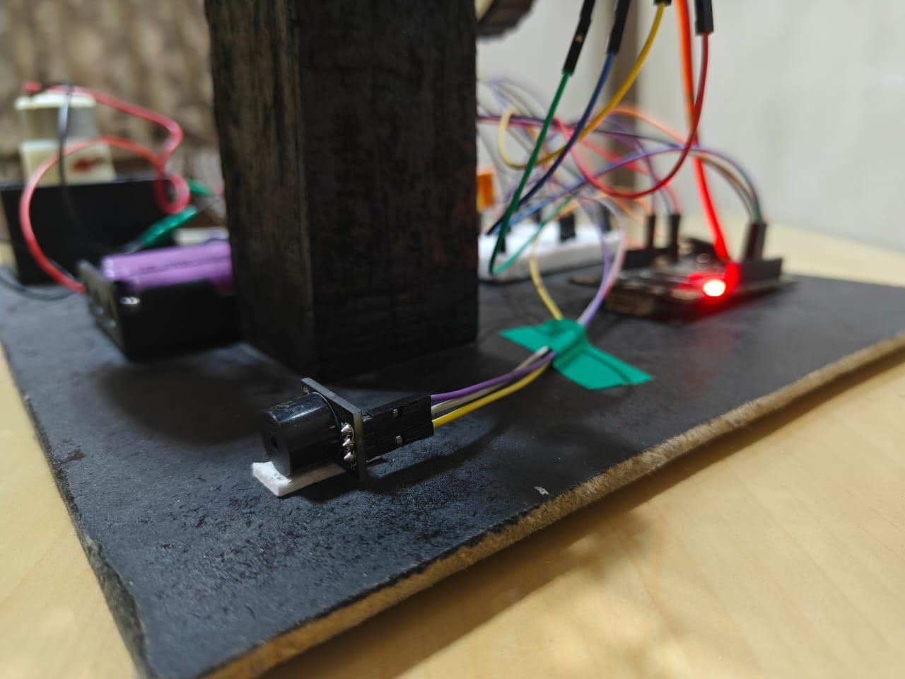 |
| Laptop Dashboard- Normal mode| 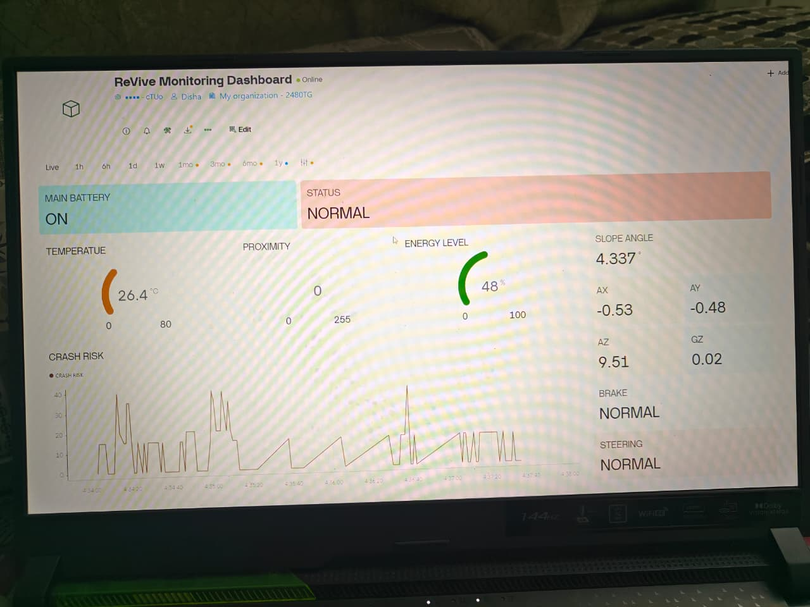 |
| Laptop Dashboard- ALERT mode| 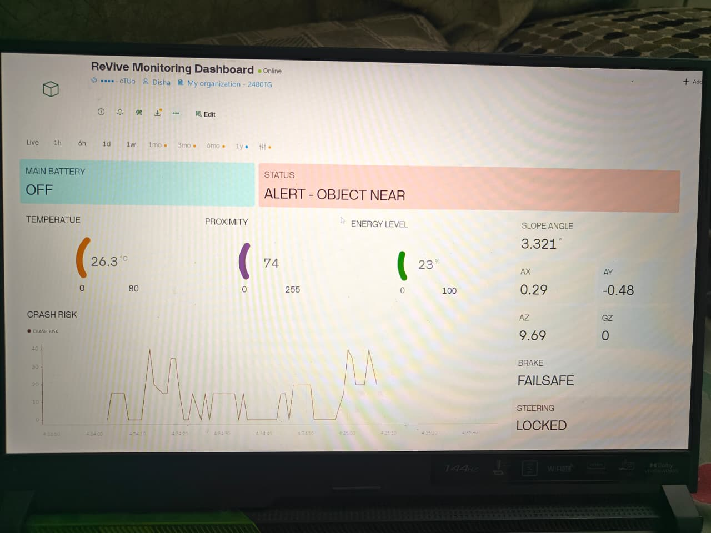 |
| Laptop Dashboard- ReVive mode| 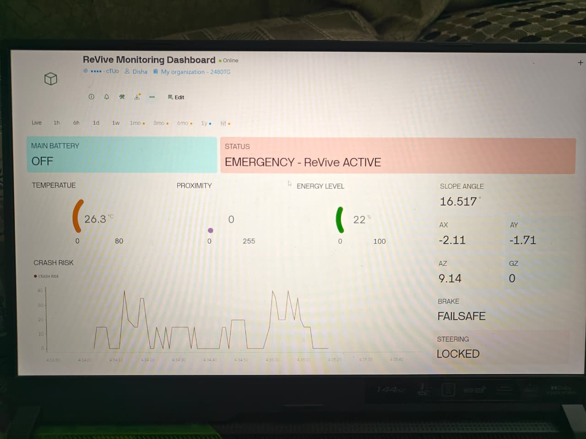 |

## D) Videos

## E) Features

### 1. Regenerative Braking Recovery of Power in Emergency Situations

ReVive incorporates a regenerative braking system. It is based on the conversion of kinetic energy into electrical energy during braking. The regenerative motor start behaving like a turbine when the vehicle is manually braked. The emergency application of this recovered energy during a main power failure is very important.

#### Why this is important
In an event of an accident or failure of your vehicle’s primary power source, you could lose much of your power to operate your vehicle’s safety equipment. However, by utilizing a small portion of recovered energy, ReVive allows for keeping many critical systems alive.

#### How It Works
- The third wheel in our prototype is an analogy on manual brake that operates as a regenerative motor during braking
- Mechanical braking creates electrical energy
- Electrical energy can be stored in a battery for later use in emergency situations
- Future scalability capabilities to recharge your vehicle’s primary batteries could extend the life of your long-range driving system through multiple brake engagement in a single event.

### 2. Dual Power Backup Intelligent Switching (Main LiPo Battery ↔️ Battery)

By introducing a smart relay-controlled switching structure to power ESP32 and all sensors without interruption, ReVive makes it easy for users. During normal use, the system uses the main battery, and the instant the main battery is switched off (after a crash/failure/manual switch) the system will automatically switch over to the backup LiPo battery without interruption.

#### Why is this important?
The majority of system will fail when the main battery dies, but ReVive will never fail.

####  Key features of an Intelligent Dual Power Backup System
- All batteries are controlled by relay logic through the ESP32
- Backup liPo battery is only operated during the main battery OFF state
- Reverse current is eliminated, thus minimising battery drain
- All sensors/alert dashboard will stay operational - regardless of emergency status

|System state| Power source| Relay Status | ESP32 Mode | Vehicle Behavior|
|------------|------------|-------------|----------|----------------|
|Main Battery ON| Main Battery| Relay Active| Normal Mode | Motors running,steering active,sensors reading,warning high slope alert|
|Main Battery OFF| Lipo Backup Battery| Relay Switched| Emergency Revive Mode|Motors stop, steering & braking assisted temporarily,OLED alerts, buzzer active, live sensor tracking, Dashboard updates|

### 3. Alert-based Emergency ReVive Mode

If the main battery goes dead, it switches to Emergency Mode, which focuses on making the user aware that something has gone wrong (lost battery) and that the diagnostics of this is being performed. As soon as you are in Emergency Mode, the buzzer will go on (making noise) for about five seconds and will show on the OLED "EMERGENCY - ReVive ACTIVE," which will ensure that you are alerted in realtime.

#### Why this is important:
In actual accidents, the visual dashboard may be broken/missing. Using local alerts will increase survival rates.

 Once an alert occurs, the following procedures will be implemented:
 
-	Buzzer will sound for five seconds.
-	OLED will show Emergency Mode.
-	Once alerted, initiate monitoring of live sensors.
-	LiPo batteries will allow continued operation of ReVive until charged.

##  **Alert -based Emergency Mode**

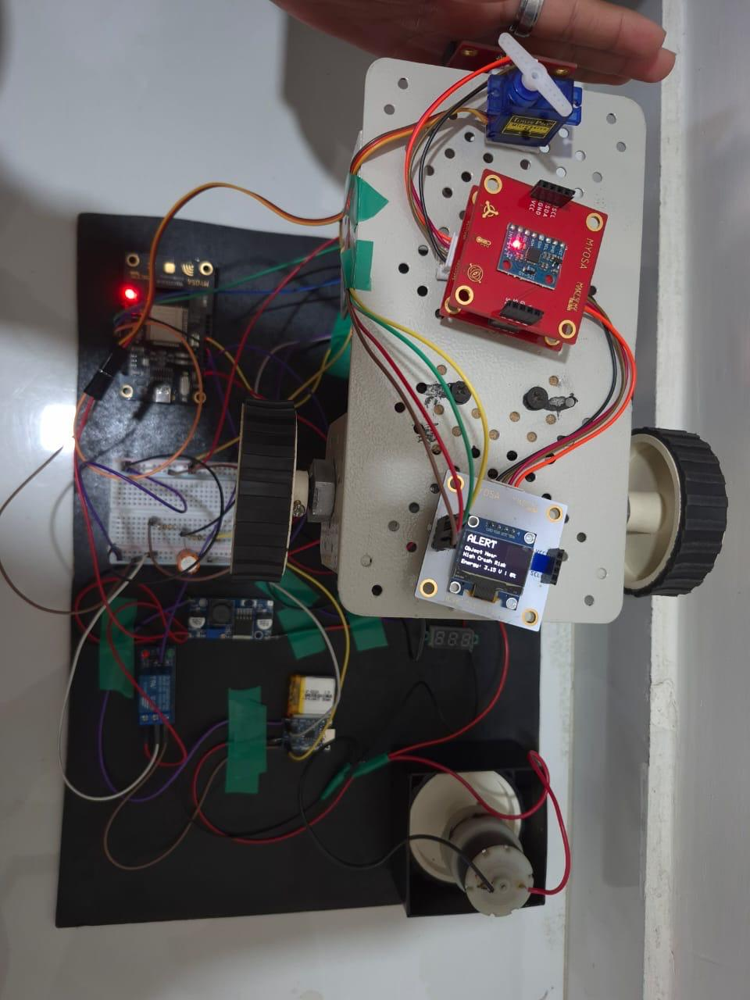

 **High crash risk detected**

<small style="color: #666;">

</small>

Full hardware assembled with motors, sensors, and safety systems

	
  
## 4. Intelligent Pre-Crash Prediction with Slope & Energy Awareness
ReVive’s Intelligent Crash Prediction is capable of predicting whether or not a driver will experience an accident based upon their vehicle's slope and energy level before the actual accident occurs. The MPU6050 sensor is utilized by ReVive to determine the slope angle as well as the tilt angle in real-time, ensuring that users know when they are crossing a critical tilt threshold through visual feedback.

The OLED screen will provide real-time visual feedback on the percentage of slope risk in near terms. In addition to the slope danger signal being displayed on the OLED screen, the current energy level will also be displayed to allow users to determine if they have enough power stored in the device to respond to emergencies.

 The features included in this section are:
 
- Continuous monitoring of tilt and orientation with an MPU6050
- Pre-Crash risk alert generated based on unsafe slope angles
- OLED display provides “WARNING, Slope angles and Crash Risk” notification in real-time
- Energy level is displayed below the Pre-Crash Risk Warning for user awareness
- Allows proactive versus reactive safety decision-making.

 ReVive provides the capability to convert inertial motion data into intelligent data that can help avoid accidents rather than simply responding to them when they occur.
   

##  **4.5 MYOSA OLED Displays**

<table>
<tr>
<td style="border: 3px solid #ff6b6b; border-radius: 12px; padding: 12px; background: #ffeaea;">

 <b style="color: #d32f2f;"> Slope Detection</b>
</td>
<td style="border: 3px solid #ff9800; border-radius: 12px; padding: 12px; background: #fff3e0;">
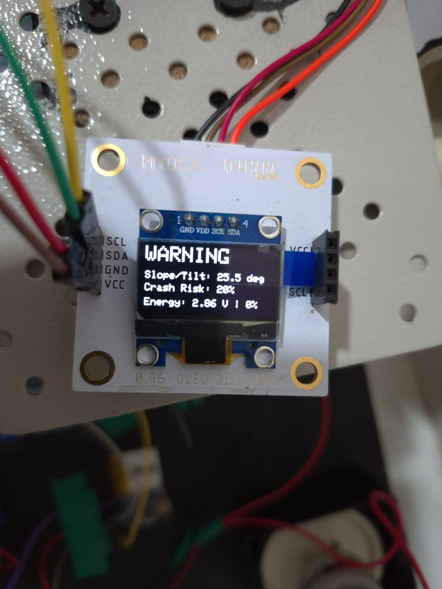
 <b style="color: #f57c00;">⚠️ Slope Warning</b>
</td>

</td>
</tr>
</table>

 Real-time OLED Warnings |  Battery Awareness

### 5.Intelligent Emergency Braking, Steering Assist & Live Dashboard Monitoring

Even in real-life scenarios, the human body can collapse, but the brain and nervous system will take over (for a short time) to maintain the protection of your essential functions.
ReVive operates on the same principle.

When the primary battery dies, the primary "body" of the vehicle (motors) shuts down, but the ReVive brain (ESP32) immediately powers back up with LiPo battery power and will not allow for the shutdown of safety intelligence when the hardware fails.

The emergency intelligence of the ReVive system allows for continued awareness, response and protection when the safety of the vehicle is compromised. Emergency control works as follows:

- When the primary battery cuts off, the relay immediately switches ESP32 to LiPo power.
- The ESP32 continues to run all sensors, logic and alerts just like a brain continues to function.
- Braking logic is still operating so that the vehicle can slow down in a controlled fashion as opposed to completely losing all ability to stop.Although no physical brake actuator is used, the system simulates braking assist through software by triggering emergency      alerts and vehicle immobilization logic, ensuring the vehicle does not continue unsafe motion during failure conditions.
- Steering assist is available for a brief period such that when a critical failure or emergency is detected, the system electronically locks the steering at a safe neutral position to prevent sudden or uncontrolled vehicle movement.
- The OLED displays the message, "EMERGENCY- ReVive ACTIVATE" along with real-time sensor data.
- A buzzer alarm will sound as confirmation of emergency activation for immediate user notification.
- In addition, the IoT dashboard on your laptop will remain active so that you can monitor the vehicle from outside, even if the display fails.

## 6. Proximity Detection and Awareness Alert

ReVive enhances user's situations with integrated proximity detection (sensor) technology that provides them with real-time updates about objects around them. When an object/vehicle is within a critical distance to the car, the ReVive system provides an immediate warning message to the driver.

An OLED will show "ALERT- Object Near", followed by a display of the user's current energy level to maintain the informative capabilities of the ReVive system in a situation of immediate risk at close proximity. The Idea behind this feature is that ReVive uses sensor-based intelligent to understand not only the movement of users, but the environment surrounding them.

### Benefits of this feature

- Detection of objects around the user with the help of proximity sensing
- The OLED will produce an "Object Near" Alert for immediate responsiveness
- The energy level will be visible on the OLED under the alert
- Valuable when visibility is low or very close to the user
- Safety is enhanced through awareness of the environment and use of proximity sensing, not only through detecting a moving target.

This adds another dimension of safety and protection to ReVive, allowing it to be a dynamic multi-layered safety solution that understands both the user and the user's surroundings.

## F) Usage Instructions
   
### How to Demonstrate ReVive

A Step-By-Step Guid for using the ReVive Prototype.
	
####  1. Power Up the System

*	Activate the main battery switch.
*	The ESP32 will boot up using energy supplied from the main battery.
*	When powered up, the OLED will provide live data from each sensor (sensor 1: MPU6050, sensor 2: BMP180, sensor 3: APDS9960).
	
####  2. Normal Operating Mode

-	The motor(s) will operate normally.
-	The servo will provide steering assistance.
-	The dashboard will provide live data feed and system status.

####  3. Using Manual-Braking (Demo of Energy Recovery through Regenerative Operation)

-	Activate the manual-braking option on the regenerative motor (i.e., turbine motor).
-   The energy created will flow to the power circuit.
-   The OLED and dashboard will indicate an increase in battery level.
	
####  4. Emergency Power-Outage (Simulation)

-	Disconnect the power from the main battery.
-	The ESP32 will shifts to Lipo battery.
-	An audio alert will sound for five seconds.
-	The OLED will display “Emergency – ReVive Active”.
-	The steering will lock for user safety.
-	Monitoring and Alerts will be continuous.

####  5.	Monitoring & Alerts

-	Having a Pre-Crash Score, depending on the amount of tilt and motion.
-	Warnings of unsafe slopes during potentially dangerous inclines will appear.
-	The dashboard will show up-to-data status in an emergency situation.

## How its works

### 1) Crash Risk Detection Logic

    tiltAngle = atan(sqrt(ax*ax + ay*ay) / abs(az)) * 57.3;
    accMag = sqrt(ax*ax + ay*ay + az*az);

    if (accMag > 18 || tiltAngle > 25) {
      crashConfidence += 30;
    }
	
This logic calculates vehicle tilt and sudden acceleration to predict unstable driving conditions.

### 2) Object Proximity Alert

      if (proximity >= 100) {
      preCrashAlert = true;
      crashConfidence += 40;
    }
	
ReVive triggers a pre-crash alert when an object is detected  close to the vehicle.

### 3) Emergency Fail-Safe Mode

      if (!mainBatteryOn) {
      steeringServo.write(90);
      digitalWrite(BUZZER_PIN, HIGH);
    }
In the event of main battery failure, steering is locked and audible warnings are activated automatically.

### 4) Energy Monitoring (Regenerative Awareness)

     energyVolt = (analogRead(ENERGY_ADC) / 4095.0) * 3.3 * 2.0;
     energyPercent = voltageToEnergyPercent(energyVolt);
This continuously monitors stored Li-Po energy representing regenerative charging.

### 5) Real-Time IoT Dashboard Update

     Blynk.virtualWrite(V9, crashConfidence);
     Blynk.virtualWrite(V10, energyPercent);
	
Critical safety and energy parameters are streamed live to the MYOSA dashboard.

## H) Tech stack

REVIVE is designed as an intelligent safety layer for electric vehicles, where every technology choice supports reliability, real-time awareness, and fail-safe behavior. The system combines embedded hardware capable of sensing motion, slope, and surroundings with real-time control software that continuously analyzes risk conditions and assists steering and braking decisions. A dedicated power management setup with backup energy storage and regulated voltage keeps the system active even during main battery failure. This foundation is further extended with IoT connectivity, allowing live monitoring, alerts, and analytics through a web-based dashboard. The following table outlines the complete technology stack used to bring this integrated, safety-focused architecture together.

### Core technologies powering REVIVE
| Category | Component / Technology | Purpose |
|--------|------------------------|---------|
| Microcontroller | **ESP32 (Wi-Fi Enabled MCU)** | Central processing unit for sensor fusion, safety logic, actuator control, and IoT connectivity. |
| Programming | **Embedded C++ (Arduino Framework)** | Implements real-time crash detection, steering assist, braking logic, and fail-safe control. |
| Motion Sensor | **MPU6050 (Accelerometer + Gyroscope)** | Detects acceleration, tilt angle. |
| Environmental Sensor | **BMP180 Barometric Sensor** | Measures altitude and temperature. |
| Proximity Sensor | **APDS9960 Proximity Sensor** | Detects nearby obstacles and enables pre-crash alerts. |
| Display | **SSD1306 OLED Display** | Shows live system status, alerts, energy level, and sensor data. |
| Actuator | **5V Servo Motor** | Provides steering assist and automatic steering lock during emergencies. |
| Alert System | **Active Buzzer Module** | Generates audible alerts for warnings and emergency conditions. |
| Backup Power | **3.7V LiPo rechargeble Battery** | Keeps the safety system operational during main battery failure. |
| Battery Charger | **TP4056 Charging Module** | Safely charges the backup battery with protection features. |
| Voltage Regulation | **DC-DC Buck Converter(LM2896)** | Steps down EV battery voltage for stable electronics operation. |
| Power Switching | **1 channel 5V Relay Module** | Switches safely between main and backup power sources. |
| Communication | **I²C & ADC Interfaces** | Ensures synchronized communication between components. |
| IoT Platform | **Blynk IoT (Web Dashboard)** | Enables real-time monitoring, graphs, alerts, and analytics. |

## I) System Requirements & Installation

To run and test the REVIVE system, a standard embedded development environment is required along with basic hardware connections. The system is designed to be lightweight and accessible, allowing it to run on commonly available development tools without any specialized setup.

###  Hardware Requirements
- **ESP32 Development Board**
- **MPU6050** – Accelerometer & Gyroscope
- **BMP180** – Barometric Pressure / Altitude Sensor
- **APDS9960** – Proximity Sensor
- **SSD1306 OLED Display (128×64)**
- **Servo Motor** – Steering Assist Demonstration
- **Active Buzzer**
- **Li-Po Battery** – Backup & Energy Storage
- **Buck Converter** – Voltage Regulation
- **Relay Module** – Main Battery Switching
- Connecting wires & regulated power supply

---

###  Software Requirements
- **Arduino IDE**
- **ESP32 Board Package**
- **Blynk IoT Platform** (Web / Desktop Dashboard)
- Stable **Wi-Fi Connection**

---

###  Required Libraries
Install the following libraries using **Arduino Library Manager**:

- Blynk
- WiFi
- Adafruit MPU6050
- Adafruit Unified Sensor
- Adafruit BMP085
- Adafruit SSD1306
- ESP32Servo

### Installation & Setup

- 1.Install Arduino IDE and add ESP32 board support from the Boards Manager.
- 2.Connect all sensors to the ESP32 using I²C (SDA & SCL) and GPIO pins as defined in the code.
- 3.Install all required libraries listed above.
- 4.Open the provided .ino file in Arduino IDE.
- 5.Update the Wi-Fi and Blynk credentials:

       char ssid[] = "your_wifi_name";
       char pass[] = "your_wifi_password";
       #define BLYNK_AUTH_TOKEN "your_blynk_auth_token"

- 6.Select the correct ESP32 board and COM port.
- 7.Upload the code to the ESP32.
- 8.Open the Blynk Dashboard on your laptop or browser to view real-time data.
- 9.Power the system using the main battery and Li-Po backup to observe normal and emergency modes.
